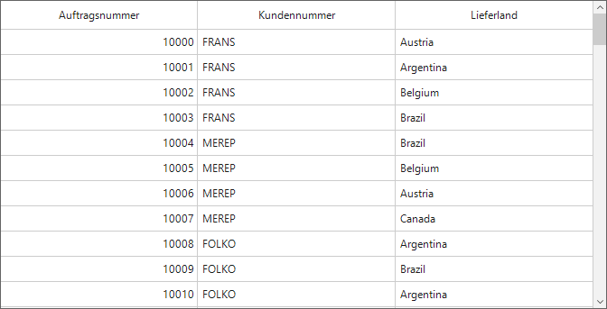

# How to change the HeaderText based on culture settings in WinForms DataGrid (SfDataGrid)?

This sample illustrates how to change the HeaderText based on culture settings in SfDataGrid.

In SfDataGrid, you can change the header text of the columns based on culture settings by adding the required text values in to the default resx(resource) file.

```C#
public Form1()
{
    InitializeComponent();
    sfDataGrid1.DataSource = new OrderInfoCollection().OrdersListDetails;

    ResourceWrapper resourceWrapper = new ResourceWrapper();
    sfDataGrid1.Columns["CustomerID"].HeaderText = resourceWrapper.CustomerIDText;
    sfDataGrid1.Columns["OrderID"].HeaderText = resourceWrapper.OrderIDText;
    sfDataGrid1.Columns["ShipCountry"].HeaderText = resourceWrapper.ShipCountryText;
}

public class ResourceWrapper
{
    const string OrderIDTextName = "OrderIDText";
    const string CustomerIDTextName = "CustomerIDText";
    const string ShipCountryTextName = "ShipCountryText";

    public ResourceWrapper()
    {
        ResourceManager rs = SfDataGrid_Demo.Properties.Resources.ResourceManager;
        OrderIDText = rs.GetString(OrderIDTextName, CultureInfo.CurrentUICulture);
        CustomerIDText = rs.GetString(CustomerIDTextName, CultureInfo.CurrentUICulture);
        ShipCountryText = rs.GetString(ShipCountryTextName, CultureInfo.CurrentUICulture);
    }

    public string OrderIDText { get; set; }
    public string CustomerIDText { get; set; }
    public string ShipCountryText { get; set; }
}
```



## Requirements to run the demo
Visual Studio 2015 and above versions